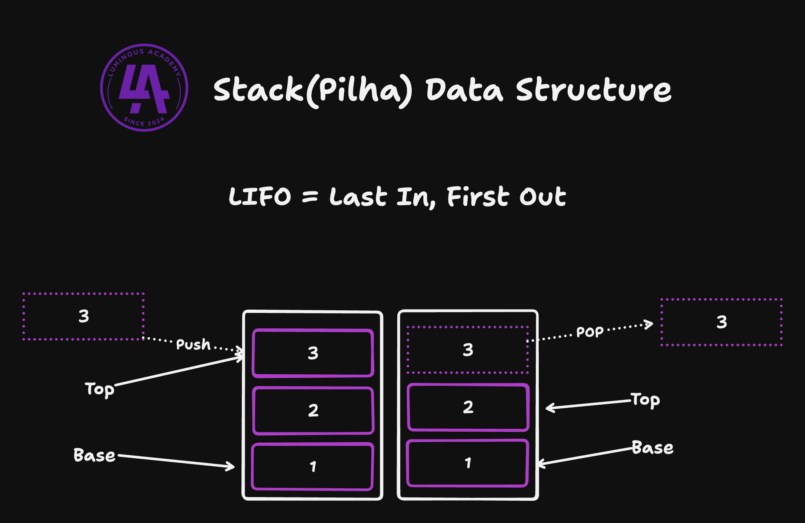

# Stack (Pilha) - Estrutura de dados

## Definição 

Uma pilha (Stack) é uma estrutura de dados linear que segue o principio Lifo (Last In First Out, isto é, o ultimo a entrar é o primeiro a sair)
Adicionar ou remover elementos acontecem na mesma extremidade chamado do Top e sua face oposta chama-se base

> **Groner, Loiane** - Estruturas de dados e algoritmos com JavaScript p. 128. Novatec Editora

## Exemplo

## Exemplo prático 
- Undo/Redo Operations (Desfazer e Refazer)

## Para lembrar

- É uma estrutura de dados linear
- Segue o principio de Last In First Out (o ultimo a entrar é o primeiro a sair)
- A adição e remoção de elementos sempre são no topo

## Operações básicas

- Push — adiciona um novo elemento ou vários elementos no topo da pilha
- Pop — Remove o elemento que está no topo da pilha
- Peek — Devolve o elemento que está no topo da pilha
- isEmpty — Devolve um booleano se a pilha está vazia ou não
- Size - retorna o tamanho da pilha
- Clear - Remove todos os elementos da pilha 